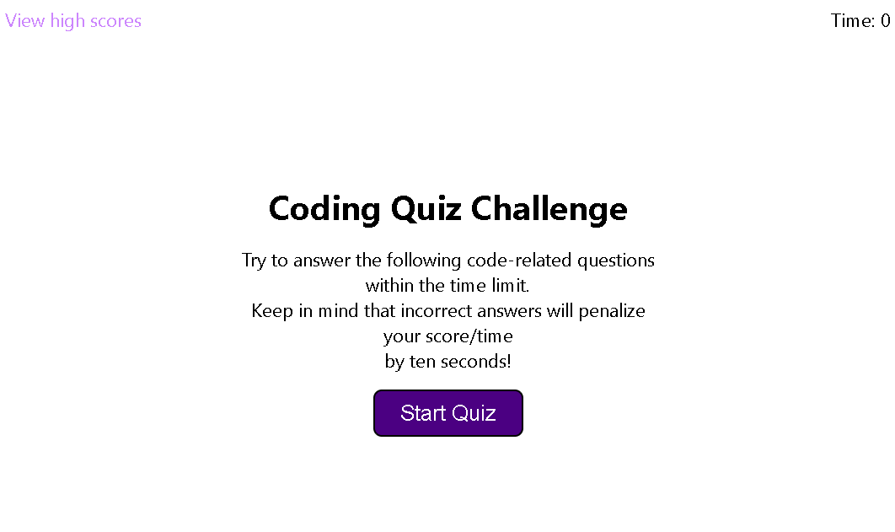
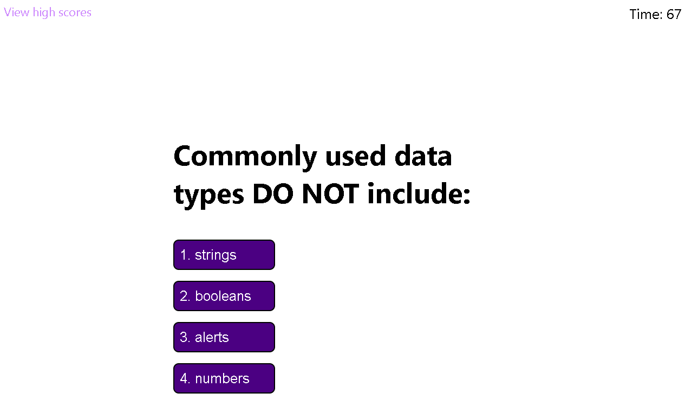

# Code Quiz

## Description

This application is a timed code quiz and built using mainly JavaScript. The quiz content is displayed and generated in one section, while the high score submission and list is in another. The JavaScript updates the content on the webpage through a few different functions mostly initiated via button press.

[GitHub Repo](https://github.com/edrezner/Code-Quiz)

[Website](https://edrezner.github.io/Code-Quiz/)

Preview Images: 

## Usage 

When loading the webpage click the 'Start Quiz' button. There is 75 seconds given to complete the quiz. A wrong answer deducts 10 seconds from the timer. The final score is the time remaining upon completion. After submitting initials a high score list is displayed which can be viewed at any time by clicking the 'View High Scores' list at the top left of the page. 

One known issue; I was unable to sort the scores from highest to lowest at this time. I was pointed in the direction of the sort() method but it is not yet implemented.

## Credits

1. Royce (Last name unknown) from AskBCS gave me some bits of code to get lines 58-64 in the JavaScript files to work correctly (parsing the high scores list into a JavaScript object).

2. Sebastion (Last name unknown) from AskBCS pointed me in the direction of using an object to store all the quiz questions, answers, and correct answer rather than trying to use a large array.

3. Natasha Mann (tutor) helped elucidate how local storage worked and how to utilize it for the purpose of this app.

4. Enrique Gomez (TA) helped write the if statement on line 67-69 of the JavaScript to eliminate the possibility of no-initials perfect scores being added to the High Scores List when selecting 'View High Scores' from the start page.

5. https://www.digitalocean.com/community/tutorials/js-json-parse-stringify - general info on how to use parse() and stringify().

6. https://developer.mozilla.org/en-US/docs/Web/API/Element/mousedown_event - mousedown events had not been known to me prior; read up on this to implement that functionality for clearing the hr element and correct/wrong text.